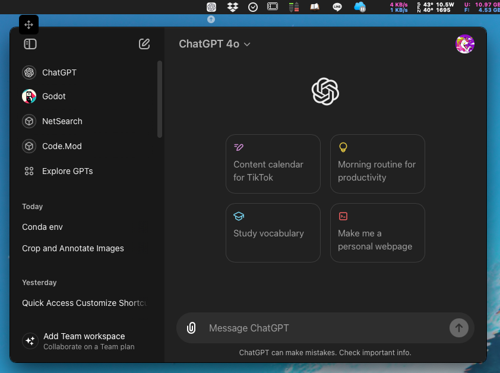

	<h1 align="center">PopChatGpt</h1>
	<h4 align="center">quick access to ChatGPT on macOS</h4>

	

## Features (功能)

- [x] Quickly pop up the ChatGPT window without searching through many programs.
    > 可快速彈出ChatGPT視窗，無需在許多程式中尋找

- [x] Default shortcut key (⌘+⇧+3) can be customized.
	> 預設快速鍵 (⌘+⇧+3) 可自行修改

- [x] Shortcut (⌘+⇧+R) for reloading the Web, useful when UI getting slow.
    > 快速鍵 (⌘+⇧+R) 在介面變慢的時候可以使用

> [!NOTE]
> The current program is primarily written to suit my usage habits.
> 
> If you have any issues or suggestions, please feel free to open an issue or contribute.